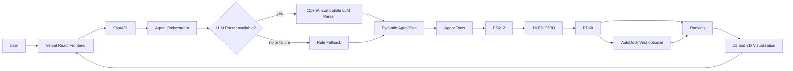
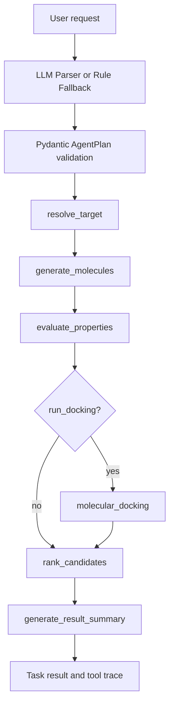

# AI Drug Design Agent

面向科研展示与在线 Demo 的靶点条件分子设计与筛选 Agent。用户可以通过结构化表单或自然语言描述任务；Agent 将意图转换为经过 Pydantic 校验的执行计划，再编排 ESM-2、DLPS-E2PO、RDKit 与 AutoDock Vina 完成候选生成、评价、可选对接、排序和展示。

[](https://frontend-augensternsys-projects.vercel.app)
[](https://augensternsy--ai-drug-design-agent-fastapi-api.modal.run)
[](docs/architecture.md)
[](#supported-targets)

> **科研边界：** 当前论文实验正式验证范围为 12 个测试靶点。项目不宣称对任意蛋白靶点均可靠，计算结果不能替代湿实验、临床判断或药物安全性评估。

## Online Demo

- Vercel：<https://frontend-augensternsys-projects.vercel.app>
- GitHub：<https://github.com/Augensternsy/ai-drug-design-agent>
- Modal API：<https://augensternsy--ai-drug-design-agent-fastapi-api.modal.run>

Modal Academic Credits 正在审核，在线 GPU 服务可能因额度或冷启动暂时不可用。无需 GPU 时可查看下方本地 mock UI 预览；它仅用于展示交互，不代表真实推理结果。

## Demo Screenshots

| 前端主页面（本地 mock UI） | Agent Tool 状态（本地 mock UI） |
| --- | --- |
|  |  |

| 分子结果卡片与 2D 结构（本地 mock UI） |
| --- |
|  |

仓库目前没有足以验证来源的真实线上生成、Vina score 和 3D 展开截图，因此没有伪造或错标。待人工补截项见 [docs/SCREENSHOT_CHECKLIST.md](docs/SCREENSHOT_CHECKLIST.md)。

## GitHub / Vercel / Backend Architecture

| Layer | Responsibility | Public/Private boundary |
| --- | --- | --- |
| GitHub | 公开工程骨架、前后端代码、测试与部署文档 | 不包含模型权重、真实 `.env` 或数据资产 |
| Vercel | React + TypeScript 静态前端 | 仅配置公开的 `VITE_API_BASE_URL` |
| Modal | FastAPI Web Endpoint、Agent、GPU 推理工具链 | LLM Key 使用 Modal Secret；模型/数据使用 Volume |
| Browser | 表单、Agent 输入、轮询、2D/3D、导出和 localStorage 历史 | 不持有 Modal Token 或 LLM Key |

## System Architecture



LLM 只负责自然语言解析与工具编排，不生成分子、不计算性质，也不替代 DLPS-E2PO 专业生成模型。完整架构和信任边界见 [docs/architecture.md](docs/architecture.md)。

## Agent Workflow



当 LLM 未配置、请求超时、HTTP 失败、JSON 无效或 AgentPlan 校验失败时，系统自动切换到确定性规则解析。fallback 仍执行相同专业工具链。

## Core Features

- 参数表单与自然语言 Agent 双入口
- 结构化 `AgentPlan`、Pydantic 校验与可见 Tool trace
- ESM-2 蛋白表征与 DLPS-E2PO 条件分子生成
- RDKit Validity、QED、SA、MolWt、LogP、Lipinski 评价
- 可选 AutoDock Vina 对接与候选排序
- RDKit 2D SVG、3D SDF 和按需加载的 3Dmol.js 查看器
- SMILES 复制、SDF/CSV/JSON 导出与 localStorage 最近任务
- GPU 冷启动、生成失败、Vina 失败和 API 错误的友好状态
- LLM rule fallback、参数白名单、请求冷却和 Demo 模式

## Tech Stack

| Layer | Technologies |
| --- | --- |
| Frontend | React 19, TypeScript, Vite, 3Dmol.js, Vercel |
| API / Agent | FastAPI, Pydantic, Python, OpenAI-compatible HTTP API, rule parser |
| ML | PyTorch, CUDA, ESM-2, DLPS-E2PO |
| Cheminformatics | RDKit, Meeko, AutoDock Vina |
| Cloud | Modal Serverless GPU, Modal Volume; optional RunPod |
| Quality | unittest/mock, compileall, TypeScript production build |

## Supported Targets

当前论文实验正式验证范围和公开 Demo 白名单均为以下 12 个测试靶点：

| Target | PDB | Target | PDB |
| --- | --- | --- | --- |
| ESR1 | 2R6W | HCRTR1 | 4ZJC |
| JAK1 | 3EYG | P2RX3 | 5SVL |
| KDM1A | 5LHG | IDH1 | 4UMX |
| RIOK1 | 4OTP | NR4A1 | 3V3Q |
| GRIK1 | 3FV1 | CCR9 | 5LWE |
| FTO | 4ZS3 | SPIN1 | 5JSJ |

支持新蛋白序列输入属于可扩展方向，不等同于新靶点已经达到论文验证范围或可靠性水平。

## API Workflow

自然语言入口：

```http
POST /api/agent/generate
Content-Type: application/json; charset=utf-8

{
  "prompt": "帮我针对 ESR1 生成 1 个候选分子，QED 优先，不进行 Vina 对接。"
}
```

表单入口：

```http
POST /api/generate
Content-Type: application/json

{
  "target": "ESR1",
  "num_samples": 1,
  "qed_threshold": 0.5,
  "sa_threshold": 3.5,
  "run_docking": false
}
```

两个入口都返回 `task_id`，前端随后轮询：

```http
GET /api/tasks/{task_id}
```

状态覆盖 `queued → loading → encoding → generating → evaluating → docking（可选）→ ranking → completed/failed`，最终返回 Agent Plan、Tool trace、候选指标、SVG、SDF 和结果总结。

## Modal Serverless GPU

- FastAPI 通过 Modal ASGI Web Endpoint 对外服务。
- GPU 容器复用现有 `app/` 与推理服务，不重写模型算法。
- `/workspace/models` 和 `/workspace/data` 由 `ai-drug-design-assets` Volume 提供。
- `ai-drug-design-agent-llm` Secret 只向后端注入四个 `LLM_*` 环境变量。
- `min_containers=0`、`max_containers=1`，空闲时自动缩容到 0。
- 当前 Modal Academic Credits 正在审核；通过前应避免非必要真实推理。

固定推理配置保持不变：

```ini
checkpoint = models/e2po/direct_ki_e2po_15k.pt
sampling_steps = 200
clamp_mode = none
```

## Vercel Frontend

- 科研工作台式 React 页面，支持移动端与键盘操作。
- 使用 `VITE_API_BASE_URL` 连接 Modal；API 地址不硬编码进业务逻辑。
- 不使用任何 `VITE_*` 变量保存 LLM Key、Modal Token 或其他 Secret。
- 支持 Agent 输入、表单输入、进度轮询、结果卡片、2D/3D、导出和本地历史。

## Cost & Security Control

- 前端和后端双重限制 `num_samples <= 5`。
- Vina 默认关闭，可仅对排名靠前的候选执行对接。
- 生成前确认、运行中按钮锁定和 cooldown 防止连续重复提交。
- 靶点白名单、阈值范围和 `dock_top_k` 在后端再次校验，非法参数返回明确 4xx。
- LLM API Key 仅保存在 Modal Secret，不进入 GitHub、Vercel bundle、响应或原始日志。
- LLM 诊断只记录 Key 是否存在、HTTP 状态和脱敏错误字段。
- Modal 自动缩容到 0，且最多保留一个 GPU 容器。
- `.env`、权重、数据、输出、缓存和临时 docking 文件均由 `.gitignore` 排除。
- LLM 或 GPU 服务不可用时提供明确错误；自然语言解析可切换 rule fallback，前端可使用 Demo UI 展示交互。
- 当前 cooldown 为单实例内存保护；若公开流量增长，应在网关增加身份认证、持久化配额和分布式限流。

## Local Development

Backend：

```bash
cp .env.example .env
pip install -r requirements.txt
python -m uvicorn app.main:app --host 0.0.0.0 --port 8000
```

Frontend：

```bash
cd frontend
cp .env.example .env.local
npm ci
npm run dev
```

```ini
VITE_API_BASE_URL=http://127.0.0.1:8000
```

本地质量检查：

```bash
cd frontend && npm run build
cd ..
python -m compileall app tests modal_app.py
python -m unittest discover -s tests -v
```

规则解析和 mock/unit tests 不需要 LLM Key、模型权重或 GPU。

## Deployment

1. 按 [Modal 部署文档](MODAL_DEPLOYMENT.md)准备 Volume、Secret 和 Web Endpoint。
2. 七牛云 OpenAI-compatible LLM 配置见 [QINIU_LLM_SETUP.md](QINIU_LLM_SETUP.md)。
3. 在 Vercel 中设置 `VITE_API_BASE_URL=<Modal HTTPS endpoint>` 并部署 `frontend/`。
4. RunPod Pod + Network Volume 备选方案见 [RUNPOD_DEPLOYMENT.md](RUNPOD_DEPLOYMENT.md)。

模型权重不随 GitHub 发布；云部署时通过 Modal Volume、RunPod Network Volume 或 Object Storage 挂载。

## Research Scope & Limitations

- 当前论文实验正式验证范围仅为上述 12 个测试靶点。
- 不应将工程上的新序列输入能力表述为“适用于任意靶点且效果可靠”。
- QED、SA、Lipinski 和 Vina 均为计算筛选指标，不等同于真实活性、选择性、ADMET、安全性或临床有效性。
- 分子生成具有随机性；候选必须经过化学合理性复核、实验验证和合规评估。
- Vina score 依赖受体结构、口袋定义、配体构象和参数设置，只适合当前工作流中的相对筛选参考。
- 公开仓库不包含 checkpoint、ESM-2 权重和完整结构数据，完整推理依赖私有资产挂载。

## Project & Career Materials

- [System architecture](docs/architecture.md)
- [Screenshot checklist](docs/SCREENSHOT_CHECKLIST.md)
- [Resume project descriptions](docs/RESUME_PROJECT.md)
- [Project highlights and interview Q&A](docs/PROJECT_HIGHLIGHTS.md)
- [2–3 minute demo script](docs/DEMO_SCRIPT.md)
