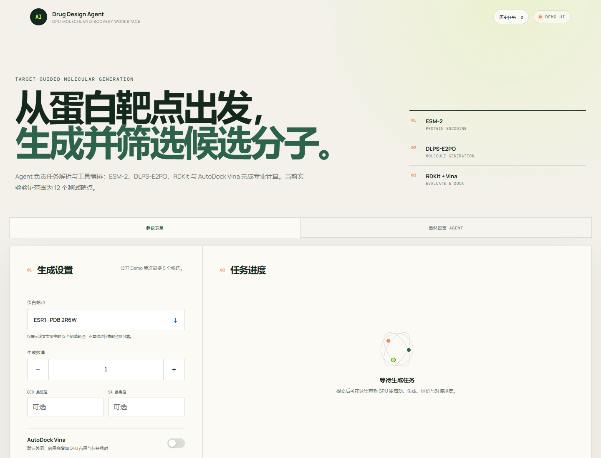
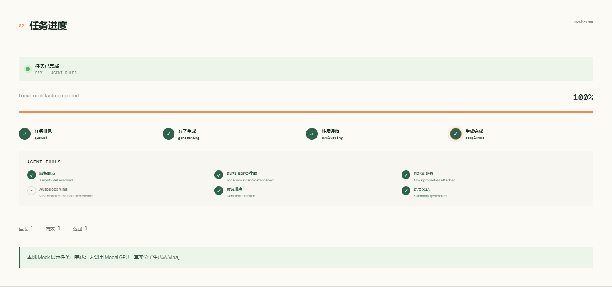
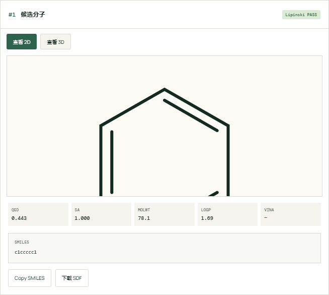
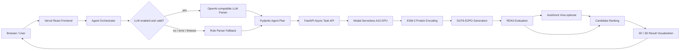
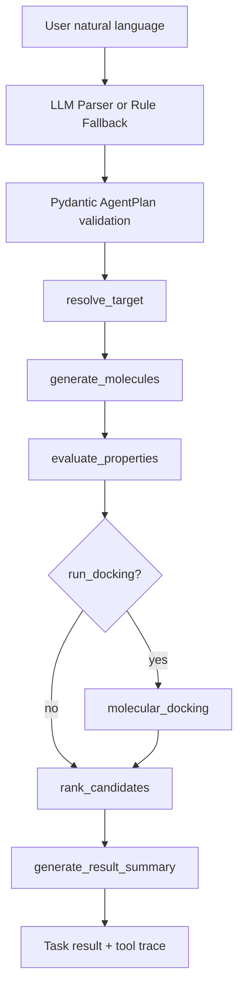
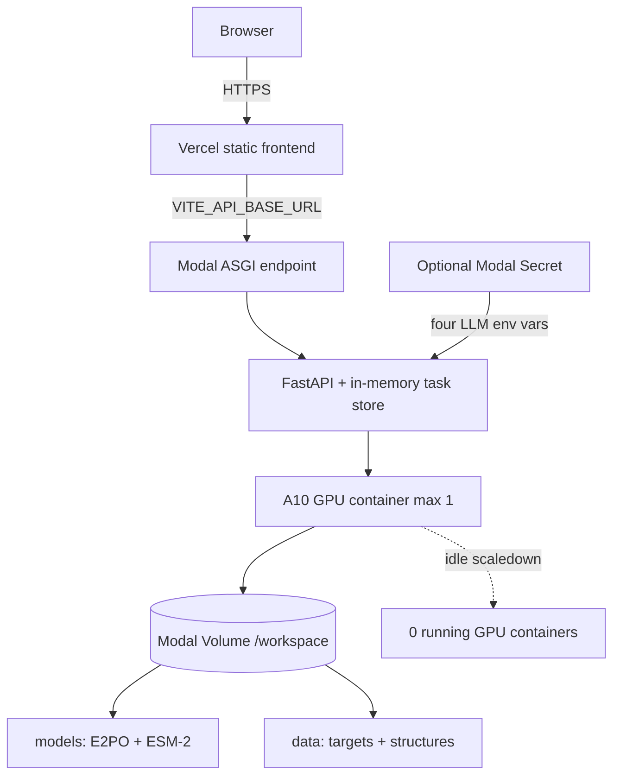

# AI Drug Design Agent

面向科研展示与在线体验的靶点条件分子生成、评价和筛选系统。用户可以通过参数表单或自然语言描述任务；Agent 将需求转换为经过 schema 校验的执行计划，并编排 ESM-2、DLPS-E2PO、RDKit 与 AutoDock Vina 专业工具链。

[](https://frontend-augensternsys-projects.vercel.app)
[](https://github.com/Augensternsy/ai-drug-design-agent)
[](MODAL_DEPLOYMENT.md)
[](#research-scope--limitations)

> **Research scope:** 当前论文实验正式验证范围为 12 个测试靶点。项目不宣称对任意蛋白靶点均可靠，计算结果不能替代湿实验、临床判断或药物安全性评估。

## Online Demo

- Web：<https://frontend-augensternsys-projects.vercel.app>
- Source：<https://github.com/Augensternsy/ai-drug-design-agent>

Modal GPU 空闲时自动缩容到 0，因此首次任务可能经历冷启动。公开 Demo 单次最多 5 个候选分子，Vina 默认关闭。

## Demo Screenshots

| Dashboard | Agent workflow |
| --- | --- |
|  |  |

| Molecule result card |
| --- |
|  |

截图由本地 Vite 页面和 mock 任务数据生成，没有调用 Modal、DLPS-E2PO 或 Vina。3Dmol.js 持续渲染会使自动元素截图无法稳定结束，因此不放置伪造占位图；发布者可在本地恢复 mock 历史任务、点击“查看 3D”后人工补截 `docs/images/molecular-3d-view.png`。

## System Architecture



完整架构、部署边界和 Tool Calling 图见 [docs/architecture.md](docs/architecture.md)。

## Agent Workflow



LLM 只负责理解任务，不生成分子、不计算性质、不替代专业模型。若 LLM 未启用、缺少配置、超时、返回非法 JSON 或未通过 Pydantic 校验，Agent 自动改用确定性规则解析器。

## Core Features

- 参数表单与自然语言 Agent 双入口
- 结构化 `AgentPlan`、Tool Calling 状态和任务总结
- ESM-2 条件表征与 DLPS-E2PO 分子生成
- RDKit 有效性、QED、SA、MolWt、LogP、Lipinski 评价
- 可选 AutoDock Vina 对接与候选排序
- RDKit 2D SVG、3D SDF 与按需加载的 3Dmol.js 查看器
- Copy SMILES、单分子/全部 SDF、CSV、JSON 导出
- localStorage 最近任务、Live/Demo 状态和移动端布局
- 规则 fallback、参数白名单、冷却、提交确认和错误可见性

## Tech Stack

| Layer | Technologies |
| --- | --- |
| Frontend | React 19, TypeScript, Vite, 3Dmol.js, Vercel |
| API / Agent | FastAPI, Pydantic, Python, OpenAI-compatible HTTP API, rule parser |
| ML | PyTorch, CUDA, ESM-2, DLPS-E2PO |
| Cheminformatics | RDKit, Meeko, AutoDock Vina |
| Cloud | Modal Serverless A10 GPU, Modal Volume; optional RunPod Network Volume |
| Quality | unittest/mock, Python compile checks, TypeScript production build |

## API Workflow

### Natural-language Agent

```http
POST /api/agent/generate
Content-Type: application/json

{
  "prompt": "帮我针对 ESR1 生成 5 个候选分子，QED 优先，SA<3.5，并对最优结果进行 Vina 对接。"
}
```

响应包含 `task_id` 和经过校验的 `plan`。前端随后轮询：

```http
GET /api/tasks/{task_id}
```

任务状态依次覆盖 queued、loading、encoding、generating、evaluating、docking（可选）、ranking、completed/failed，并返回 Tool trace、候选指标、SVG、SDF 和结果总结。

### Form API

```http
POST /api/generate
Content-Type: application/json

{
  "target": "ESR1",
  "num_samples": 3,
  "qed_threshold": 0.5,
  "sa_threshold": 3.5,
  "run_docking": false
}
```

## Deployment Architecture



- 模型权重和结构数据不进入 GitHub，通过 `/workspace/models` 与 `/workspace/data` 挂载。
- Vercel 只保存公开的 `VITE_API_BASE_URL`，不保存 Modal Token 或 LLM Key。
- Agent LLM Secret 只注入后端；不配置时使用规则 fallback。

## Supported Targets

目前正式验证和公开 Demo 白名单均为以下 12 个测试靶点：

| Target | PDB | Target | PDB |
| --- | --- | --- | --- |
| ESR1 | 2R6W | HCRTR1 | 4ZJC |
| JAK1 | 3EYG | P2RX3 | 5SVL |
| KDM1A | 5LHG | IDH1 | 4UMX |
| RIOK1 | 4OTP | NR4A1 | 3V3Q |
| GRIK1 | 3FV1 | CCR9 | 5LWE |
| FTO | 4ZS3 | SPIN1 | 5JSJ |

## Fixed Inference Configuration

模型权重不随 GitHub 发布，部署时通过持久化 Volume 或 Object Storage 挂载。最终推理配置保持：

```ini
checkpoint = models/e2po/direct_ki_e2po_15k.pt
sampling_steps = 200
clamp_mode = none
```

## Local Development

### Backend

```bash
cp .env.example .env
pip install -r requirements.txt
python -m uvicorn app.main:app --host 0.0.0.0 --port 8000
```

规则解析无需任何 LLM 配置。启用兼容 Provider 时，只在后端 `.env` 设置：

```ini
LLM_ENABLED=true
LLM_BASE_URL=https://provider.example/v1
LLM_API_KEY=replace-with-private-key
LLM_MODEL=compatible-model-name
```

`LLM_BASE_URL` 可以是 API base（如 `/v1`），也可以是完整的 `/v1/chat/completions` URL，适用于 OpenAI、DeepSeek 及其他兼容服务。请求固定 10 秒超时，失败后不重试外部服务，而是立即回退规则解析。

当前 Modal 的七牛云配置与 Secret 创建命令见 [QINIU_LLM_SETUP.md](QINIU_LLM_SETUP.md)。真实 API Key 仅通过 Modal Secret 注入，不进入源码、示例环境文件或 Vercel。

### Frontend

```bash
cd frontend
cp .env.example .env.local
npm ci
npm run dev
```

```ini
VITE_API_BASE_URL=http://127.0.0.1:8000
```

生产验证：

```bash
npm run build
cd ..
python -m compileall app tests
python -m unittest discover -s tests -v
```

## Modal + Vercel Deployment

1. 按 [MODAL_DEPLOYMENT.md](MODAL_DEPLOYMENT.md) 挂载私有资产 Volume 并部署 FastAPI。
2. 如需 LLM，在 Modal Secret 中配置四个 `LLM_*` 变量；不需要重新上传模型资产。
3. 在 Vercel 项目中设置 `VITE_API_BASE_URL=<Modal HTTPS endpoint>`。
4. 部署 `frontend/`，由 Vercel 执行 `npm run build`。

RunPod 方案仍独立可用：[RUNPOD_DEPLOYMENT.md](RUNPOD_DEPLOYMENT.md)。

## Security & Cost Control

- 前端与 Pydantic/API 双重限制 `num_samples <= 5`。
- Vina 默认关闭；Agent 支持只对 QED 最优候选执行对接。
- 提交确认、运行中按钮锁定、15 秒前端/后端冷却降低重复任务风险。
- 靶点白名单、阈值范围和 `dock_top_k` 均返回明确 4xx。
- LLM Key 只从后端环境读取，不进入响应、前端 bundle、日志或 Git。
- LLM 日志仅记录异常类型，不记录 prompt、Provider 响应或 Secret。
- Modal `min_containers=0`、`max_containers=1`，空闲自动缩容到 0。
- `.env`、权重、数据、输出、日志、缓存和临时 docking 文件均由 `.gitignore` 排除。
- 当前内存冷却适用于个人作品 Demo；面向高流量服务仍应增加网关配额、身份验证和持久化限流。

## Research Scope / Limitations

- 当前论文实验正式验证范围仅为上述 12 个测试靶点。
- 即使未来接受蛋白序列输入，也必须重新验证适用域，不能表述为“任意靶点均可靠”。
- QED、SA、Lipinski 和 Vina 是计算筛选指标，不等同于真实活性、选择性、ADMET、安全性或临床有效性。
- 分子生成具有随机性，候选必须经过复核、实验验证和合规评估。
- 公开仓库不包含私有 checkpoint、ESM-2 权重和结构数据，因此完整推理依赖外部资产挂载。

## Portfolio Material

- 系统架构：[docs/architecture.md](docs/architecture.md)
- 中文简历项目描述与面试口述版：[docs/RESUME_PROJECT.md](docs/RESUME_PROJECT.md)
- Modal 部署：[MODAL_DEPLOYMENT.md](MODAL_DEPLOYMENT.md)
- Vercel 部署：[VERCEL_DEPLOYMENT.md](VERCEL_DEPLOYMENT.md)
