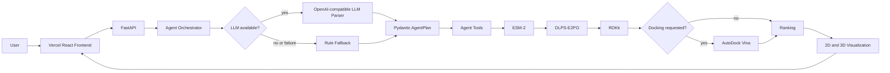
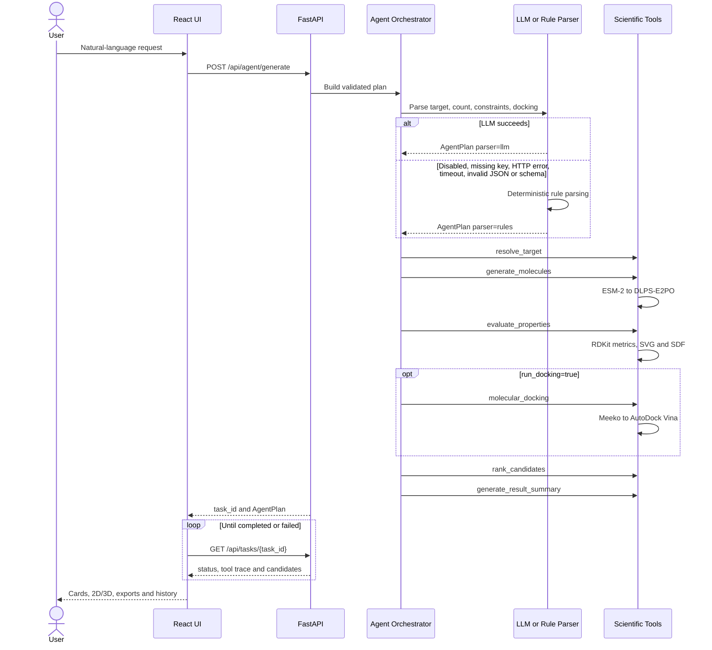

# System Architecture

本文描述公开 Demo 的组件边界、Agent Tool Calling 顺序和云部署拓扑。LLM/Rule Parser 只把自然语言转换为结构化计划；ESM-2、DLPS-E2PO、RDKit 和 AutoDock Vina 才承担专业计算。

## 1. 系统总体架构



边界说明：

- `FastAPI` 接收请求、校验参数并提供异步任务状态。
- `Agent Orchestrator` 负责理解任务、选择工具和保存 Tool trace，不执行专业计算。
- `LLM Parser` 仅在配置完整且响应通过 Pydantic 校验时使用；否则进入 `Rule Fallback`。
- `DLPS-E2PO` 是专业分子生成模型；LLM 不替代它。
- `RDKit` 负责结构有效性、性质、2D SVG 和 3D SDF；Vina 只在显式请求时运行。

## 2. Agent Tool Calling 流程



每个工具具有单一职责：

| Tool | Responsibility |
| --- | --- |
| `resolve_target` | 验证 12 靶点白名单并解析序列/结构资产 |
| `generate_molecules` | 调用 ESM-2 与 DLPS-E2PO 生成候选 |
| `evaluate_properties` | 使用 RDKit 验证并计算分子指标 |
| `molecular_docking` | 按需准备配体并调用 AutoDock Vina |
| `rank_candidates` | 根据请求目标和可用指标排序 |
| `generate_result_summary` | 汇总执行状态、筛选结果和失败信息 |

## 3. 部署架构

```mermaid
flowchart LR
    B[Browser] -->|HTTPS| V[Vercel]
    V -->|VITE_API_BASE_URL| E[Modal Web Endpoint]
    E --> API[FastAPI and Agent]
    API --> GPU[Serverless GPU]
    GPU --> VOL[(Modal Volume)]
    VOL --> M[/workspace/models]
    VOL --> D[/workspace/data]
    SEC[Modal Secret] -->|LLM configuration| API
    GPU -. idle .-> ZERO[Scale to zero]
```

部署信任边界：

- Browser/Vercel 只知道公开 API 地址，不持有 LLM Key 或 Modal Token。
- `ai-drug-design-agent-llm` Secret 只注入 Modal 后端。
- `ai-drug-design-assets` Volume 保存不进入 GitHub 的模型和数据。
- `min_containers=0`、`max_containers=1` 控制公开 Demo 的空闲成本与并发上限。
- 当前 Modal Academic Credits 正在审核，审核期间不应执行非必要 GPU 测试。

## 4. 固定约束与科研边界

- `checkpoint = models/e2po/direct_ki_e2po_15k.pt`
- `sampling_steps = 200`
- `clamp_mode = none`
- 公开请求最多生成 5 个候选，Vina 默认关闭。
- LLM API Key 不跨越后端信任边界。
- 当前论文正式验证范围为 12 个测试靶点，不代表任意靶点均可靠。
