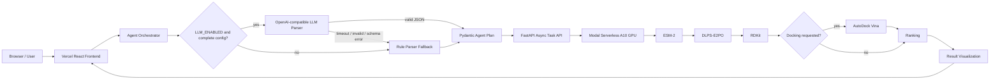
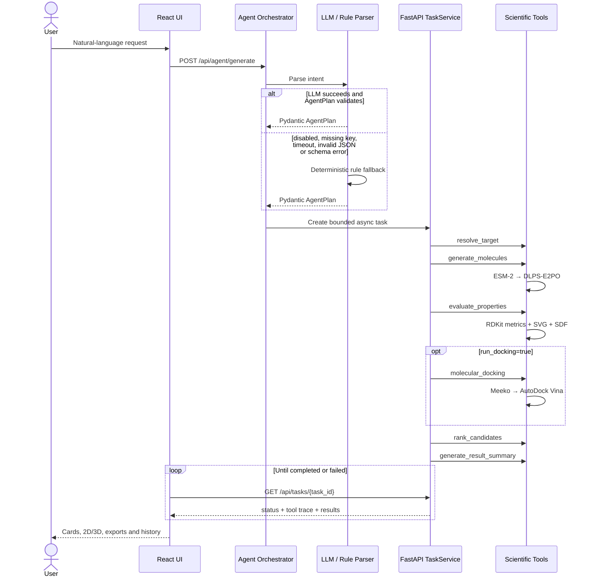

# System Architecture

本文描述公开 Demo 的工程边界。LLM/Rule Parser 只把用户语言转换为结构化计划；ESM-2、DLPS-E2PO、RDKit 和 AutoDock Vina 才承担专业计算。

## End-to-end architecture



## Agent Tool Calling



## Deployment and trust boundaries

```mermaid
flowchart TB
    subgraph Public[Public browser boundary]
        B[Browser]
        V[Vercel frontend]
        LS[(localStorage task history)]
        B <--> V
        V <--> LS
    end

    subgraph Backend[Modal backend boundary]
        H[HTTPS ASGI endpoint]
        F[FastAPI + Agent]
        GPU[A10 GPU container]
        H --> F --> GPU
    end

    subgraph Private[Private assets and secrets]
        S[Modal Secret: optional LLM variables]
        VOL[(Modal Volume)]
        M[/workspace/models]
        D[/workspace/data]
        VOL --> M
        VOL --> D
    end

    V -->|Only public API base URL| H
    S -->|Server-side injection only| F
    VOL --> GPU
    GPU -. idle .-> ZERO[Scale to zero]
```

## Invariants

- `checkpoint = models/e2po/direct_ki_e2po_15k.pt`
- `sampling_steps = 200`
- `clamp_mode = none`
- Public requests are limited to at most five candidates.
- The LLM API key never crosses the backend trust boundary.
- The formally evaluated research scope is 12 test targets, not arbitrary targets.
